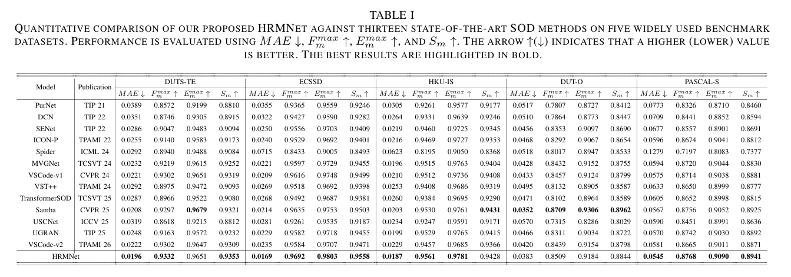
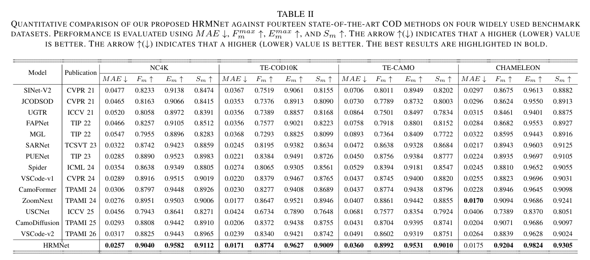
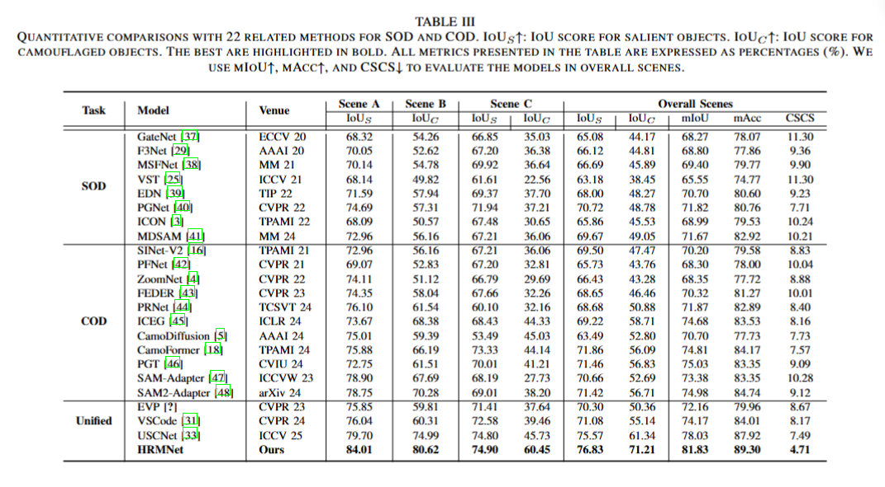
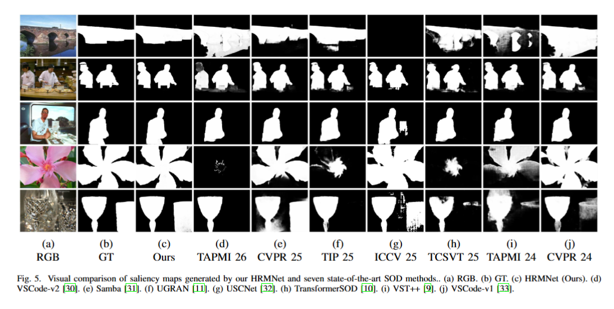
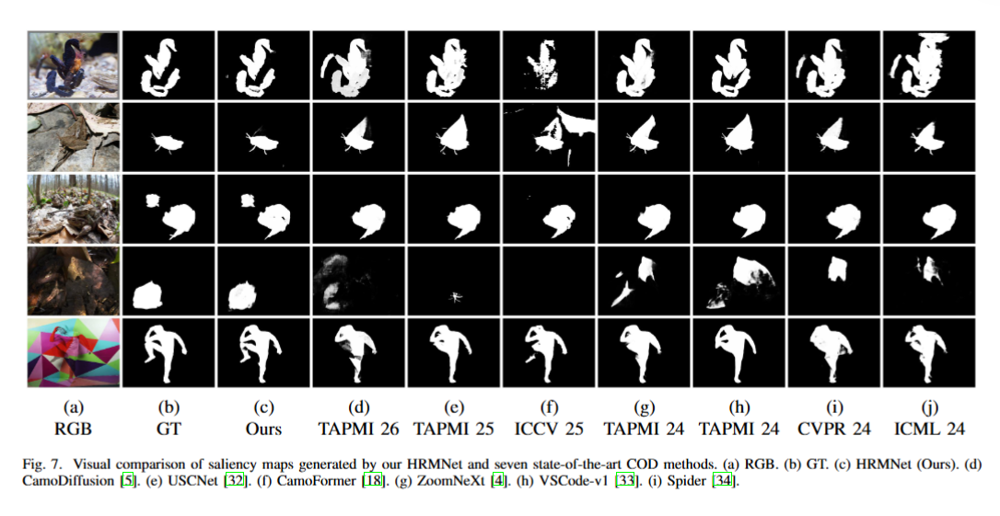

# HRMNet

This is an official implementation for "HRMNet: A Universal Hierarchical Refinement Guided Metaformer Network for Salient and Camouflaged Object Detection"

## Environmental Setups

python>=3.7 pytorch>=1.13

```
conda create -n hrmnet python=3.8
conda activate hrmnet
pip install -r requirements.txt
```

### Train/Test

### Data Preparation

We provide [download link](https://pan.baidu.com/s/1D2VcNgngWD3udEapbUUs2g?pwd=euca) for the SOD dataset，[download link](https://pan.baidu.com/s/1wdK6RYHkk9FK97Stw6z8ew?pwd=35bn) for the COD dataset, [download link](https://pan.baidu.com/s/1TuTHbVL9AIRmxXU33_RJJQ?pwd=rsu8) for the USCOD dataset.


We randomly selected images from multiple test datasets for validation.

### Dataset Structure

```
dataset/
├─SOD_dataset/
│ ├─train/
│ │ ├─DUTS-TR/
│ │ ├─...
│ └─test/
│   ├─PASCAL-S/
│   ├─DUTS-TE/
│   ├─...
└─COD_dataset/
  ├─train/
  │ ├─COD10K-TR/
│   ├─...
  └─test/
    ├─TE-CAMO/
    ├─TE-COD10K/
    ├─...
```
The structure of each dataset is shown below
```
TE-CAMO/
├─bound/
├─GT/
├─RGB/
├─...
```

For USCOD's dataset partitioning strategy, see [link](https://github.com/ssecv/USCNet)

### pretrain

./pretrained contains several backbone pre-trained checkpoint files with their corresponding configuration files

train on multi-GPUs

```
CUDA_VISIBLE_DEVICES=1,2,3,4  python -m torch.distributed.launch --nproc_per_node=4 distributed.py \
   --backbone pvtv2_b5 --optim_preset step_adam_simple \
   --pretrain_batch 60 --finetune_batch 8 --mfusion LSF \
   --log_path ./log/ --pretrain_size 384 --finetune_size 576 --task COD --gpu_id 0 --test_now
```

### model and log

```
path/to/log/
├─record/
├─args.json
├─config.yaml
└─ckpt/#checkpoints
```

test 
```
python test.py --test_model /path/to/log/ --gpu_id 0
```

* **Salmaps**   

The salmaps of the above datasets can be download from [SOD-here](https://pan.baidu.com/s/1vMxIoR0O-lH2r-gc2RKvXQ?pwd=kp69) and [COD-here](https://pan.baidu.com/s/1umAybyg2BgKeECplOgMczw?pwd=n97g) and [USCOD-here](https://pan.baidu.com/s/19wKyO55lLovHbnpl-zhbdQ?pwd=piat).

## Evaluation and Visual Analysis

refer to [SOD_Evaluation_Metrics](https://github.com/zyjwuyan/SOD_Evaluation_Metrics)

## Results
* **Qualitative comparison**  



Fig.1 Qualitative comparison of our proposed method with some SOD SOTA methods.  



Fig.2 Qualitative comparison of our proposed method with some COD SOTA methods.



Fig.2 Qualitative comparison of our proposed method with some USCOD SOTA methods.

* **Quantitative comparison** 



Table.1 Quantitative comparison with some SOTA models on some public SOD benchmark datasets. 



Table.2 Quantitative comparison with some SOTA models on some public COD benchmark datasets. 


# Related works
- CVPR 24 - Samba: A Unified Mamba-based Framework for General Salient Object Detection [[Code](https://github.com/Jia-hao999/Samba)]
- TPAMI 24 - ZoomNeXt: A Unified Collaborative Pyramid Network for Camouflaged Object Detection [[Code](https://github.com/liuzywen/ZoomNeXt)]
- ICCV 25 - USCNet: Rethinking Detecting Salient and Camouflaged Objects in Unconstrained Scenes [[Code](https://github.com/ssecv/USCNet)]
- TPAMI 26 - VSCode-v2: Dynamic Prompt Learning for General Visual Salient and Camouflaged Object Detection with Two-Stage Optimization [[Code](https://github.com/Sssssuperior/VSCode)]